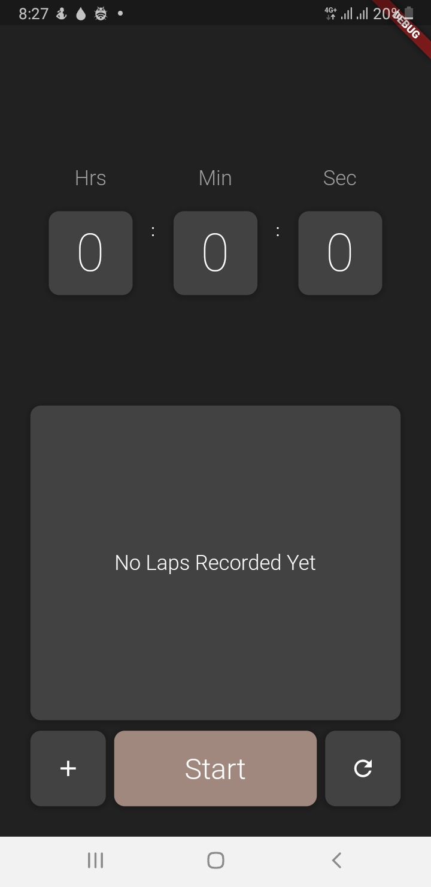

# Clockiest - A Beautiful Stopwatch App

Clockiest is a Flutter-based stopwatch application created during an internship at Code Casa. It features a user-friendly interface, lap timing, and a sleek design.

## Table of Contents
- [Introduction](#introduction)
- [Demo](#demo)
- [Features](#features)
- [Dependencies](#dependencies)
- [Getting Started](#getting-started)
- [Contributing](#contributing)
- [License](#license)
- [Contact](#contact)

## Introduction

Clockiest is an elegant stopwatch app built with Flutter, designed for an intuitive user experience. This project was developed during an internship at Code Casa to explore Flutter app development and user interface design.

## Features

- **User-Friendly Interface**: Clockiest provides an attractive and intuitive user interface for an enhanced user experience.

- **Lap Timing**: Record and view lap times with ease, helping you track your progress.

## Dependencies

Clockiest relies on the following Flutter dependencies:

- [`cupertino_icons: ^1.0.2`](https://pub.dev/packages/cupertino_icons): Cupertino Icons for iOS-style icons.

- [`provider`](https://pub.dev/packages/provider): A state management library for efficient app state management.

- [`hidden_drawer_menu: ^3.0.1`](https://pub.dev/packages/hidden_drawer_menu): A Flutter library for creating a hidden drawer menu.
